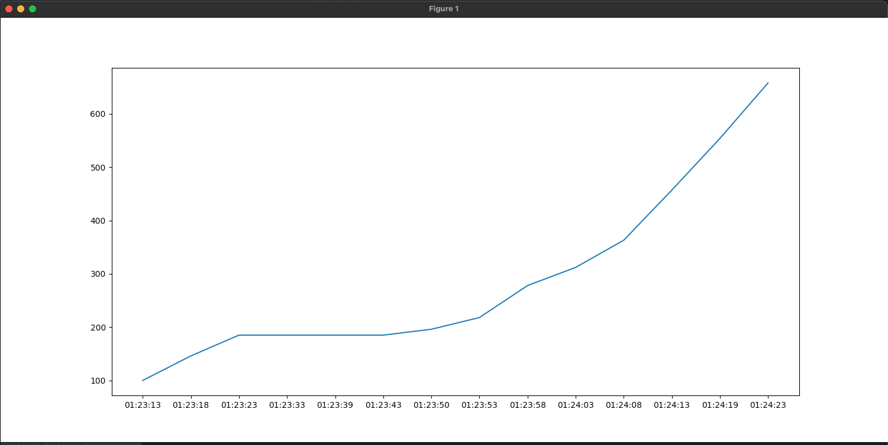

# Replication-Lag-Visualizer

A simple cli based tool to visualize the replication lag in realtime.

## Supported Database:
- Postgres

### How to run?
- clone the repo
- create a virtualenv with : `virtualenv -p python3 venv`
- Install requirements.txt : `pip install -r requirements.txt`
- cd lag_visualizer/
- Run:
  - `python main.py --host 123.us-east-1.postgres.aws --username postgres --password ABC@890 --slot myslot`
  - refer to following parameters table for various available options.
### Parameters:
| name | description|default|
|--------|---|---|
| `host` | Postgres Hostname	| localhost
| `port` | Postgres Port	| 5432
| `database` | Postgres Database	| postgres
| `user` | Postgres Username	| postgres
| `password` | Postgres Password | postgres
| `slot` | Replication slot name	|
| `frequency` | frequency of polling in seconds	| 1
| `unit` | lag size unit e.g. b,kb,mb,gb	| mb
| `mode` | mode of visualization e.g. web, matplotlib	| web

## Features:
- creates timeseries replication lag graph in realtime with given `frequency` of given `slot`.
- Two modes supported:
    - Matplotlib based graph
    - Web based graph

## Screenshot:
### Web Mode:

### Matplotlib Mode:

